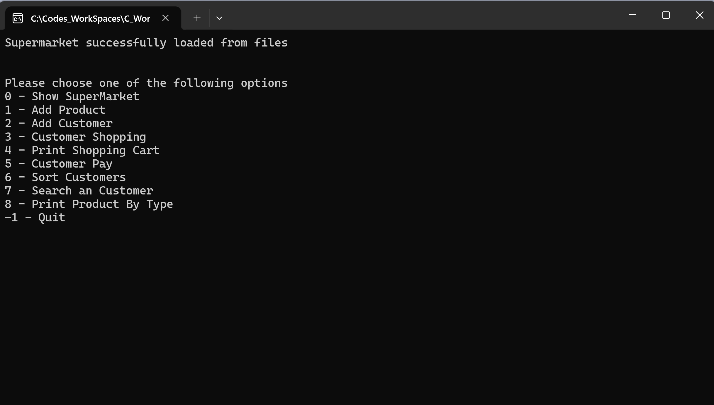
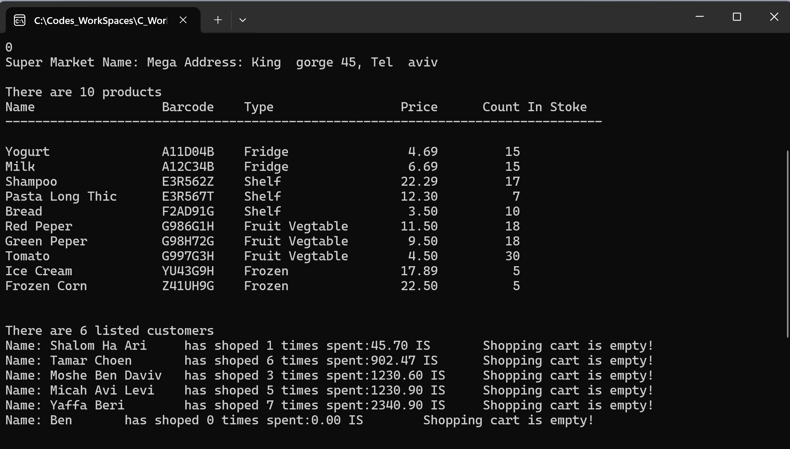
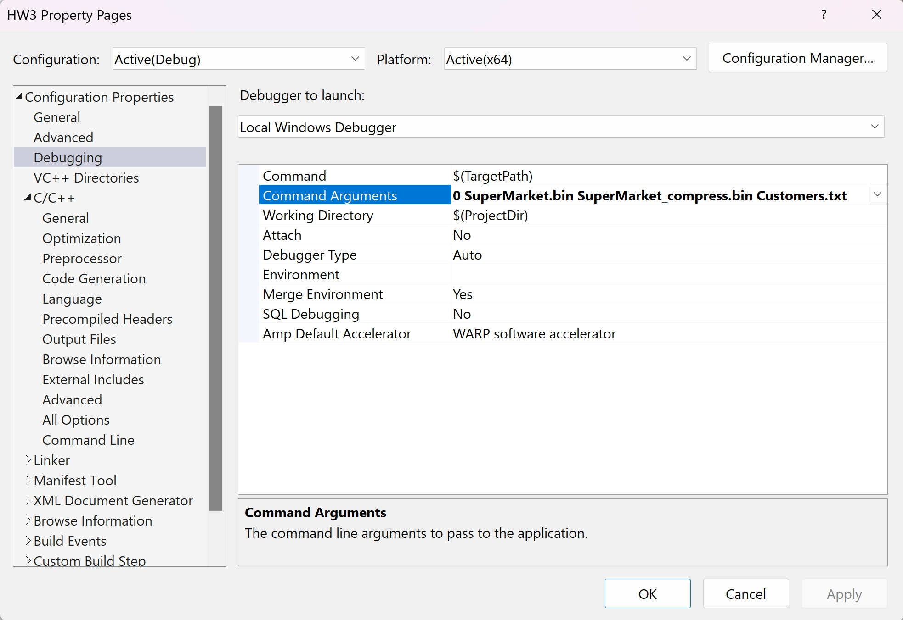

# Supermarket Management System

## Overview
The **Supermarket Management System** is a comprehensive, C-based application designed to efficiently manage supermarket operations. It includes features for product inventory management, customer tracking, shopping cart operations, and file handling. The system supports both compressed and uncompressed file storage formats to enhance data management and persistence.

## Demo Video
Watch the demo video of the project here: [YouTube Link](https://youtu.be/8bLR7oVUjfo)

## Screenshots

[](#)
[](#)
[](#)

## Features
### **Product Management**
- Add and update products
- Track inventory levels
- Barcode-based product identification
- Categorization of products:
  - Fruits & Vegetables
  - Refrigerated Items
  - Frozen Items
  - Shelf Items

### **Customer Management**
- Customer registration and profile management
- Shopping history tracking
- Total spend calculation
- Shopping cart management

### **Shopping Features**
- Real-time shopping cart updates
- Product purchases and checkout process
- Payment processing
- Receipt generation

### **Data Organization**
- Sorting customers by name, shopping frequency, or total spend
- Customer search functionality
- Product filtering based on category

### **File Operations**
- Supports compressed and uncompressed file storage
- Handles both binary and text file formats
- Ensures data persistence between sessions

## Technical Concepts
This project incorporates various advanced C programming techniques, including:

### **1. Advanced Data Structures**
- Linked lists implementation
- Dynamic arrays for flexible data storage
- Complex struct relationships and nested data structures
- Custom data type definitions (enums, structs)

### **2. Memory Management**
- Dynamic memory allocation and deallocation
- Prevention of memory leaks
- Efficient pointer manipulation

### **3. File Operations**
- Handling of binary and text files
- Implementation of file compression techniques
- Robust error handling for file operations

### **4. Bit Manipulation**
- Data compression using bitwise operations
- Usage of bit fields and bit masks
- Efficient processing with bitwise operators

### **5. Modular Programming**
- Organized into multiple modules for maintainability
- Usage of header files and include guards
- Function pointers for enhanced flexibility

### **6. Advanced C Features**
- Implementation of variadic functions
- Use of preprocessor directives
- Macros for code optimization
- Type casting for improved type safety

### **7. Sorting and Searching**
- Implementation of sorting algorithms
- Binary search for quick lookups
- Custom comparison functions for sorting flexibility
- Efficient data filtering techniques

### **8. Error Handling**
- Input validation to prevent invalid data entry
- Checks for memory allocation failures
- Validation of file operations
- Graceful error recovery mechanisms

## Building and Running the Project
### **Prerequisites**
- C compiler (GCC recommended)
- Make utility (optional, for automated builds)
- Visual Studio (for Windows users with `.sln` project support)

### **Compilation**
#### **Using GCC (Linux/Mac)**
To compile the project, use the following command:
```bash
gcc -o supermarket main.c Supermarket.c Product.c Customer.c ShoppingCart.c ShoppingItem.c Address.c General.c fileHelper.c SuperFile.c GeneralList.c -I.
```

#### **Using Visual Studio (Windows)**
1. Open `SupermarketManagement.sln` in Visual Studio.
2. Build the solution using **Ctrl + Shift + B** or from the **Build** menu.
3. Run the project from Visual Studio.

### **Running the Program**
Execute the program using the following syntax:
```bash
./supermarket <compression_flag> <input_file> <compressed_file> <customers_file>
```
#### **Example Execution**
```bash
./supermarket 0 SuperMarket.bin SuperMarket_compress.bin Customers.txt
```

## Project Structure
The project is structured into several modular components for better maintainability:

- **`main.c`** – Program entry point and menu handling
- **`Supermarket.c/.h`** – Core supermarket functionality
- **`Product.c/.h`** – Product management logic
- **`Customer.c/.h`** – Customer-related operations
- **`ShoppingCart.c/.h`** – Shopping cart functionalities
- **`fileHelper.c/.h`** – Utility functions for file operations
- **`General.c/.h`** – Miscellaneous helper functions
- **`SuperFile.c/.h`** – File compression and decompression logic
- **`SupermarketManagement.sln`** – Visual Studio project file

## Authors
- **Yuval Zaltsman**
- **Ben Mishael**

